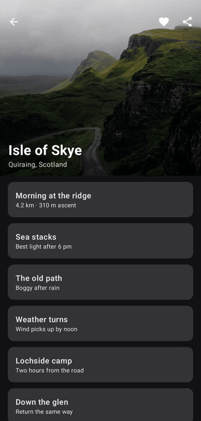
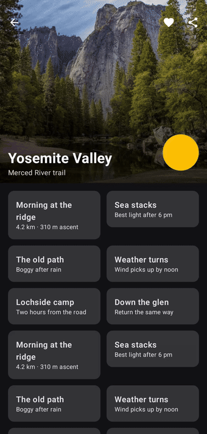
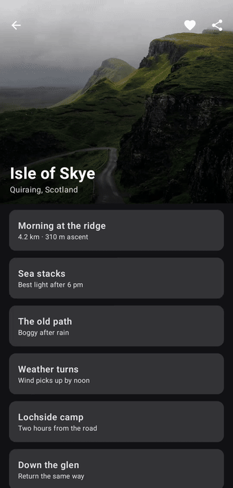
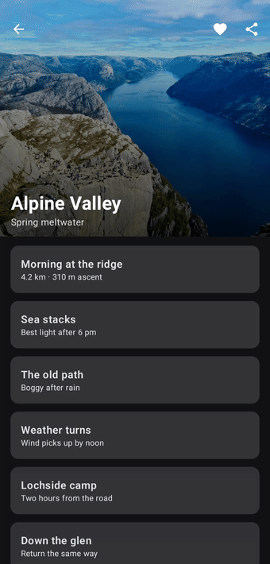
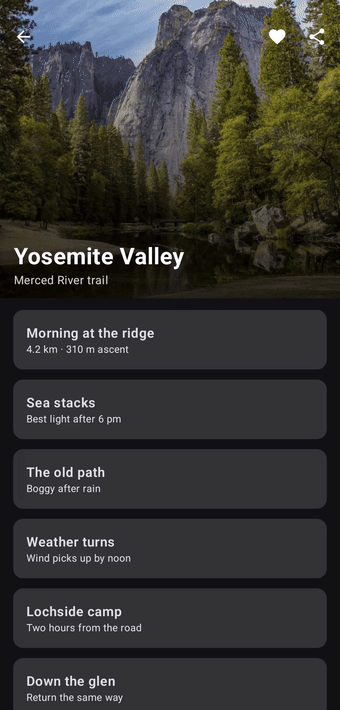
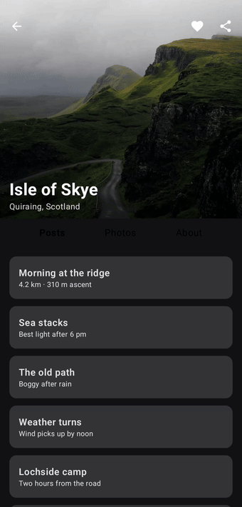

<div align="center">

# ComposeParallaxToolbar

**Collapsing toolbar layout for Compose Multiplatform.**<br>
<sub>Parallax header · any scrollable body · scroll modes · pinned tabs · pull-to-refresh · elements that move into the toolbar</sub>

[](https://central.sonatype.com/artifact/am.highapps.parallaxtoolbar/compose-parallax-toolbar-kmp)
[](https://kotlinlang.org)
[](https://github.com/JetBrains/compose-multiplatform)
[](#compatibility)
[](LICENSE)

`ComposeParallaxToolbarLayout` provides slots for a header, a title and a scrollable body. The
header collapses through nested scrolling, so any vertically scrollable composable can be the
body. State is hoisted, the collapse fraction is available to every slot, and behavior is
configured through immutable config objects.

<table>
  <tr>
    <td width="50%" align="center" valign="top"></td>
    <td width="50%" align="center" valign="top"></td>
  </tr>
</table>

</div>

## Features

| | |
|---|---|
| **Any scrollable body** | A column, a `LazyColumn`, or anything else that scrolls: grids, staggered grids, pagers. The header collapses through nested scrolling. |
| **Scroll modes** | Exit until collapsed, enter always, or enter always collapsed with the toolbar sliding away. Optional snap on release. |
| **Header height** | A fixed size, an aspect ratio or a fraction of the screen, each with a cap. |
| **Per-element behaviors** | Give any header element its own parallax, fade or scale, pin a chip row so it stays in view as long as possible, and glide elements such as an avatar from the header into the toolbar. |
| **Bottom slot** | Tabs or a search field pinned under the toolbar. |
| **Overscroll stretch** | With a trigger callback for pull-to-refresh. |
| **Hoisted state** | The collapse fraction, `collapse()` and `expand()`, saved across configuration changes and process death. |
| **Accessibility** | State announcements, expand and collapse actions, reading order, a heading for the title. |
| **Platforms** | Right-to-left layouts, window insets and display cutouts, the iPhone status bar, and mouse wheel and trackpad on desktop and web handled for you. |

## Installation

Add the dependency to the source set that holds your screens: `commonMain` in a Compose
Multiplatform project, the app module in an Android-only project.

```kotlin
dependencies {
    implementation("am.highapps.parallaxtoolbar:compose-parallax-toolbar-kmp:2.0.0")
}
```

iOS, desktop and web apps use it from their Kotlin shared module; nothing is imported on the
Swift or JavaScript side. A Swift-only app adds one small Kotlin module for the screen, since
Compose has no Swift API. The [platform guide](docs/PLATFORMS.md) shows the setup and the one
iOS `Info.plist` key Compose needs.

## Quick start

```kotlin
import am.highapps.parallaxtoolbar.ComposeParallaxToolbarLayout
import am.highapps.parallaxtoolbar.ParallaxContent
import am.highapps.parallaxtoolbar.ParallaxToolbarDefaults

@Composable
fun AlbumScreen(album: Album, onBack: () -> Unit, onShare: () -> Unit) {
    ComposeParallaxToolbarLayout(
        titleContent = { collapsed ->
            Text(
                album.title,
                style = if (collapsed) MaterialTheme.typography.titleMedium else MaterialTheme.typography.headlineMedium
            )
        },
        subtitleContent = { Text(album.artist) },
        headerContent = {
            Image(album.cover, contentDescription = null, Modifier.fillMaxSize(), contentScale = ContentScale.Crop)
        },
        navigationIcon = { IconButton(onClick = onBack) { Icon(Icons.AutoMirrored.Filled.ArrowBack, null) } },
        actions = { IconButton(onClick = onShare) { Icon(Icons.Default.Share, null) } },
        content = ParallaxContent.Lazy(
            content = { collapsed -> items(album.tracks) { TrackRow(it) } },
            config = ParallaxToolbarDefaults.lazyColumnConfig(contentPadding = PaddingValues(16.dp))
        )
    )
}
```

The Material calls are the app's choice; the library has no Material dependency. Every slot
receives `collapsed` and runs in a `ParallaxToolbarScope`, which also exposes the continuous
`collapseFraction`. Use `ParallaxContent.Regular` for a scrolling column, or
`ParallaxContent.Custom` to bring your own scrollable:

```kotlin
content = ParallaxContent.Custom {
    LazyVerticalGrid(GridCells.Fixed(2), Modifier.fillMaxSize()) { items(photos) { PhotoCell(it) } }
}
```

## Configuration

Everything is set through small immutable configs built by `ParallaxToolbarDefaults`:

```kotlin
ComposeParallaxToolbarLayout(
    // ...slots...
    headerConfig = ParallaxToolbarDefaults.headerConfigWithPercentage(
        heightPercentage = 0.4f,
        maxHeight = 320.dp,
        scrollMode = ScrollMode.EnterAlways,
        snapOnRelease = true,
        stretchEnabled = true
    ),
    onStretchTrigger = { refresh() },
    toolbarConfig = ParallaxToolbarDefaults.toolbarConfig(targetColor = MaterialTheme.colorScheme.surface, elevation = 3.dp),
    titleConfig = ParallaxToolbarDefaults.titleConfig(collapsedScale = 0.8f, collapsedAlignment = Alignment.CenterHorizontally),
    bottomContent = { TabRow(/* ... */) },
    contentPadding = padding // from Scaffold
)
```

| Config | What it controls |
|---|---|
| `headerConfig` | Height, gradient, initial state, parallax factor, scroll mode, snap and its threshold, fade, stretch, animation spec |
| `toolbarConfig` | Colors and their animation, elevation, height |
| `titleConfig` | Title and subtitle padding, collapsed scale and alignment, subtitle behavior |
| `bodyConfig` | Extra space after the content and the background behind it |
| `semanticsConfig` | Strings announced to screen readers |

Two parameters sit on the layout itself: `windowInsets`, which defaults to the status bar plus
the display cutout and takes `WindowInsets(0)` when the layout does not touch the window edge,
and `collapseEnabled`, which locks the header for loading or editing states. The
[API reference](docs/API.md) lists every parameter and default.

## Scroll modes

<table>
  <tr>
    <td width="33%" align="center" valign="top"><br><sub><b>ExitUntilCollapsed</b> (default)</sub></td>
    <td width="33%" align="center" valign="top"><br><sub><b>EnterAlways</b></sub></td>
    <td width="33%" align="center" valign="top"><br><sub><b>EnterAlwaysCollapsed</b></sub></td>
  </tr>
</table>

Scrolling up always collapses the header first. What happens on the way back down is the mode:
expand only once the body is at its top, expand immediately anywhere, or slide the toolbar away
too and bring it back first.

```kotlin
headerConfig = ParallaxToolbarDefaults.headerConfig(scrollMode = ScrollMode.EnterAlwaysCollapsed)
```

## Snap and title alignment

<table>
  <tr>
    <td width="50%" align="center" valign="top"><br><sub><b>snapOnRelease</b></sub></td>
    <td width="50%" align="center" valign="top"><br><sub><b>collapsedAlignment</b> and <b>collapsedScale</b></sub></td>
  </tr>
</table>

```kotlin
headerConfig = ParallaxToolbarDefaults.headerConfig(snapOnRelease = true),
titleConfig = ParallaxToolbarDefaults.titleConfig(collapsedAlignment = Alignment.CenterHorizontally, collapsedScale = 0.85f)
```

## Bottom slot, pull-to-refresh and overlay

<table>
  <tr>
    <td width="50%" align="center" valign="top"><br><sub><b>bottomContent</b> and <b>stretchEnabled</b></sub></td>
    <td width="50%" align="center" valign="top"><br><sub><b>overlayContent</b> with <b>moveBetween</b></sub></td>
  </tr>
</table>

`bottomContent` pins a row under the toolbar. It rides the header's bottom edge while expanded
and stays put once collapsed; the body starts beneath it. `stretchEnabled` lets a pull past the
top stretch the header; release springs it back and, past `stretchTriggerDistance`, calls
`onStretchTrigger`. `overlayContent` sits above the body and the toolbar, so an element there can
glide from the header into the toolbar with `moveBetween`.

```kotlin
bottomContent = { TabRow(/* ... */) },
headerConfig = ParallaxToolbarDefaults.headerConfig(stretchEnabled = true),
onStretchTrigger = { viewModel.refresh() },
overlayContent = {
    Avatar(Modifier.size(72.dp).moveBetween(expanded = Alignment.BottomEnd, collapsed = Alignment.CenterEnd, collapsedScale = 0.5f))
}
```

## State and effects

```kotlin
val state = rememberParallaxToolbarState()
val scope = rememberCoroutineScope()

ComposeParallaxToolbarLayout(/* ... */, state = state)

Text("${(state.collapseFraction * 100).toInt()} %")
Button(onClick = { scope.launch { state.collapse() } }) { Text("Collapse") }
```

Inside any slot the scope offers modifiers for per-element effects:

```kotlin
headerConfig = ParallaxToolbarDefaults.headerConfig(parallaxMultiplier = 0f, fadeOnCollapse = false),
headerContent = {
    Image(cover, null, Modifier.fillMaxSize().parallax(0.5f).fadeOnCollapse())
    Text("Est. 1998", Modifier.align(Alignment.BottomEnd).scaleOnCollapse(0.6f).fadeOnCollapse())
    ChipRow(Modifier.align(Alignment.BottomStart).pin(stopAtTop = true))  // stays in view until the header's edge reaches it
}
```

## Documentation

| | |
|---|---|
| [API reference](docs/API.md) | Every parameter, config, state member and modifier |
| [Recipes](docs/RECIPES.md) | Complete screens for common tasks, compiled on every CI run |
| [Platform guide](docs/PLATFORMS.md) | Android edge-to-edge and `Scaffold`, iOS hosting, desktop, web |
| [Migrating from 1.x](docs/MIGRATION.md) | Every change and the upgrade steps |
| [Changelog](CHANGELOG.md) | Release notes |
| [Docs site](https://haykarustamyan.github.io/ComposeParallaxToolbar/) | Generated API docs and all guides |

**Using an AI coding assistant?** Point it at [llms.txt](llms.txt), or drop
[docs/agents/SKILL.md](docs/agents/SKILL.md) into your project's agent instructions. It holds the
current signatures, the rules that matter, and the 1.x habits to avoid.

## Sample app

The `sample` module is an interactive playground shared by Android, iOS, desktop and web. It
opens on a photo header with the library defaults; a bar at the bottom moves the header, shows
the collapse progress and switches the scroll mode, and its gear opens a sheet with presets,
the fixed example screens and every setting. See [sample/README.md](sample/README.md) for how
to run each host.

## Compatibility

| | Tested with |
|---|---|
| Kotlin | 2.4.20 |
| Compose Multiplatform | 1.12.1 |
| Android | API 24+ |
| iOS | 15.0+, arm64 devices and Apple Silicon simulators |
| Desktop | JVM 21+ |
| Web | Kotlin/Wasm |

The library depends only on `org.jetbrains.compose.ui:ui` and `org.jetbrains.compose.foundation:foundation`.

## Versioning

Semantic versioning: breaking changes ship only in a major version. The public API is explicit
and its dump under `compose-parallax-toolbar-kmp/api/` is checked on every pull request. A
deprecated API keeps working for at least one minor release, carries a `ReplaceWith`, and is
removed in the next major. Report bugs through [issues](https://github.com/haykarustamyan/ComposeParallaxToolbar/issues)
and security concerns as described in [SECURITY.md](SECURITY.md).

## Contributing

See [CONTRIBUTING.md](CONTRIBUTING.md). The project follows the [code of conduct](CODE_OF_CONDUCT.md).

## Acknowledgments

The original motion was inspired by Morad Azzouzi's article
[Collapsing toolbar with parallax effect and curve motion in Jetpack Compose](https://proandroiddev.com/collapsing-toolbar-with-parallax-effect-and-curve-motion-in-jetpack-compose-9ed1c3c0393f).

## Author

Created by [Hayk Arustamyan](https://github.com/haykarustamyan). If the library saves you time,
a star on GitHub or a [coffee](https://ko-fi.com/haykarustamyan) is appreciated.

## License

[MIT](LICENSE)
